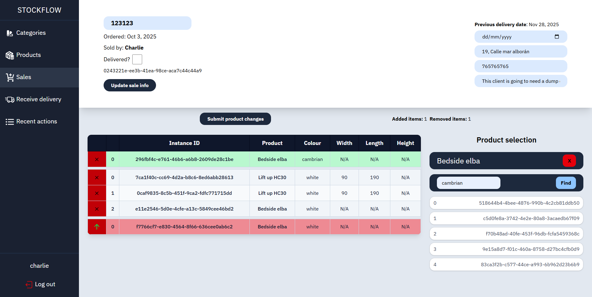

# Stockflow Frontend



This project is the frontend for a stock management and sales processing system for a small furniture shop.

The main use cases for this are the following:

- Listing and managing categories of products held.
- Viewing products and their information and managing these products.
- Viewing the instances of these products being managed, and viewing a count of these products grouped by certain filters.
- Processing orders and assigning held products to an order, also managing existing orders.

This project was generated using [Angular CLI](https://github.com/angular/angular-cli) version 20.3.1.

## Development server

To start a local development server, run:

```bash
ng serve
```
